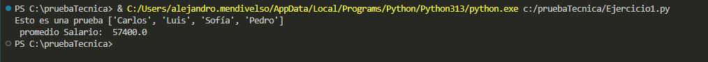
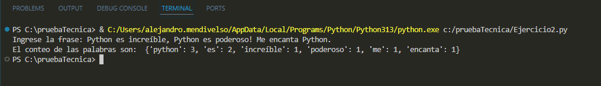
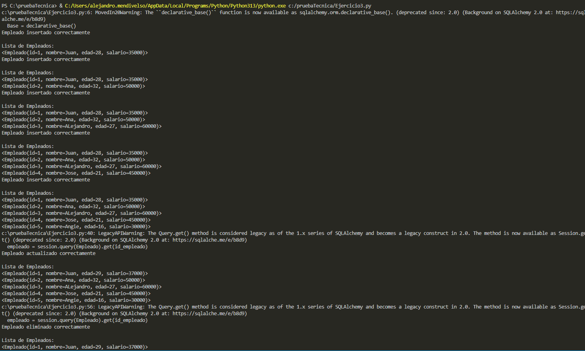
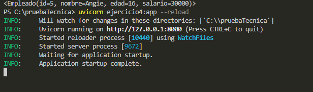
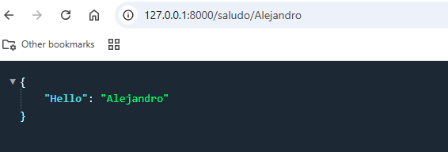
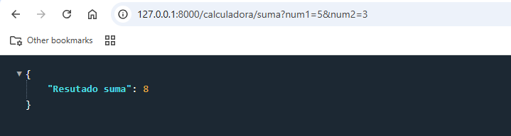
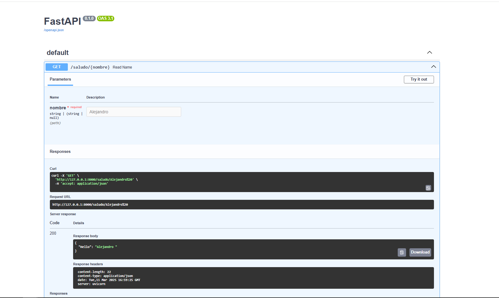
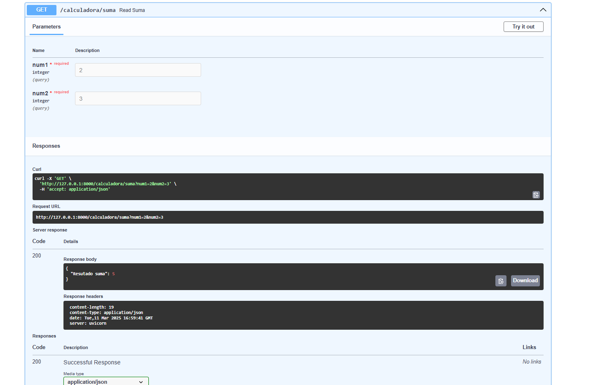
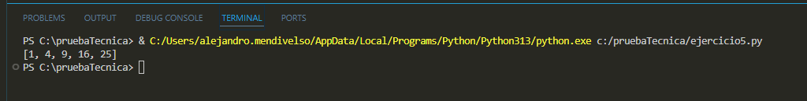

# Ejercicios prueba tecnica en python

Se realiza la prueba técnica en Python donde se solicita la demostración de diferentes técnicas para el uso del lenguaje, donde entre ella el uso de SQL y creación de API.


## Instalaciones recomendadas

Para el uso de este proyecto se recomiendo tener las siguentes isntalaciones

```bash
  pip install SQLALchemy
  pip isntall flask
  pip install pytest
```
    
## Pruebas de ejecucio

Para el primer ejercicio para el manejo de lista de diccionarios contamos con la siguiente salida:



Para el segundo ejercicio para el analisis de texto contamos con la siguiente salida:



Para el tercer ejercicio para la creacion de la base de datos y el ORM contamos con la siguiente salida:



Para el cuarto ejercicio para la creacion del API contamos con la siguiente salida:







Para el quinto ejercicio para la ejecucion en paralelo contamos con la siguiente salida:




